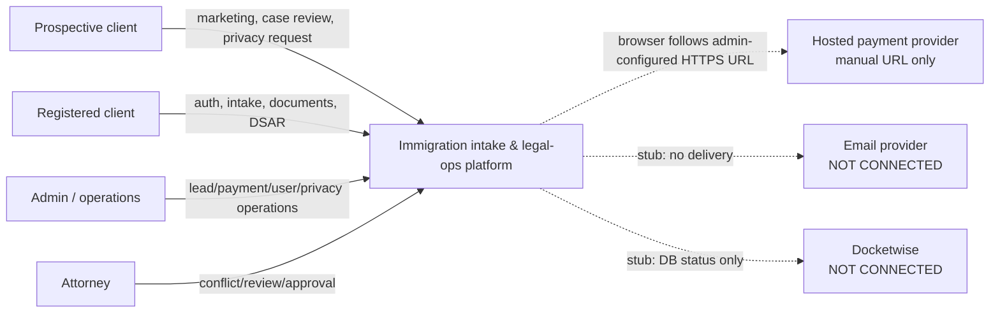
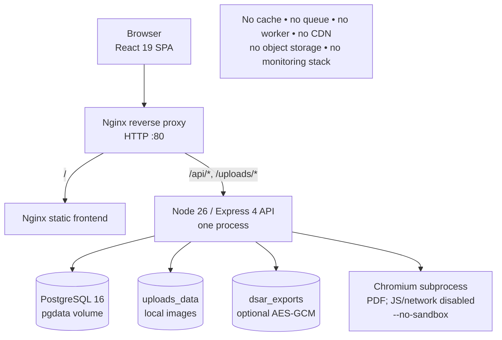
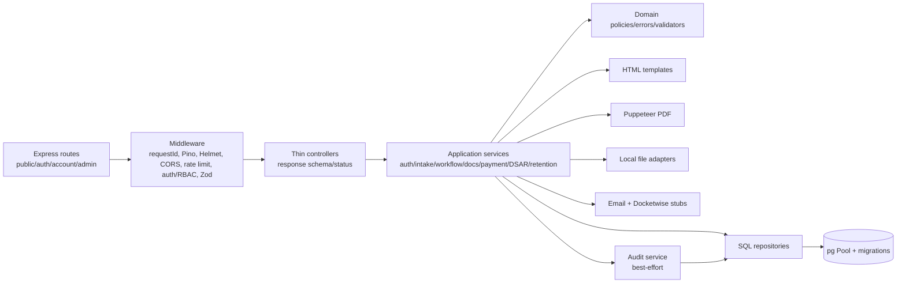
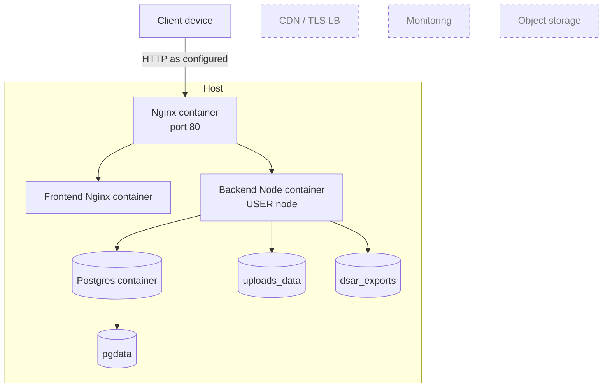
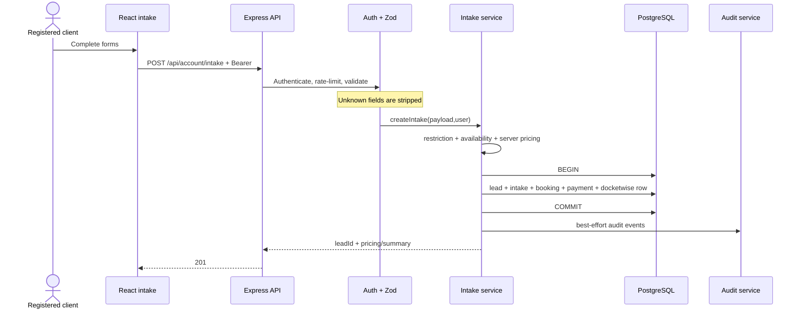
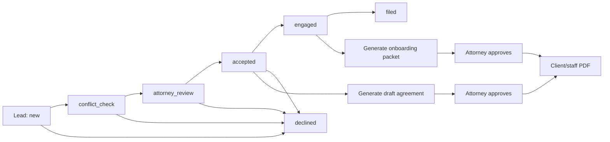
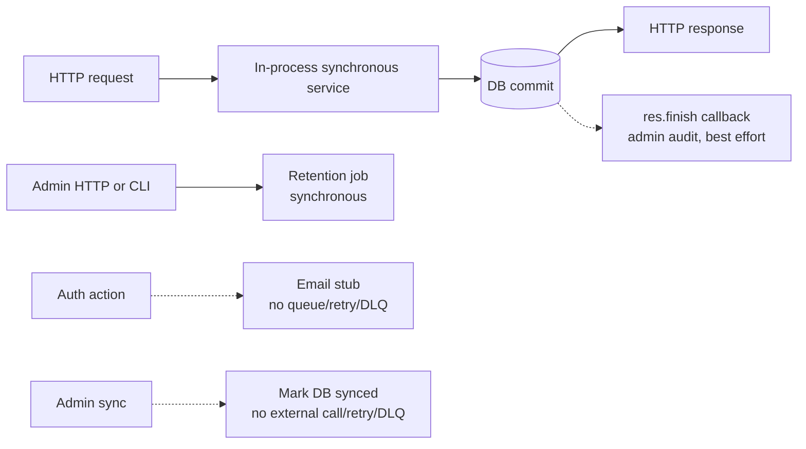

# Архитектура as-is

## 1. Классификация

Проект — **слоистый модульный монолит** с отдельным SPA frontend и одной backend runtime. Это не microservices и не event-driven система: все business modules загружаются в один Node.js process, используют один PostgreSQL и прямые imports. Наличие `domain/services/repositories` даёт элементы clean/layered architecture, но обратные зависимости из `utils` в `services`, большие cross-domain services и прямой общий pool не соответствуют строгой Clean/Hexagonal architecture.

Фактическая стадия: **advanced MVP / beta**, локально исполнимый, но не staging/production-ready из-за SEC-001 и P1 blockers.

## 2. System Context

Trust boundaries: Internet→Nginx; browser→Bearer API; refresh token→HttpOnly cookie; staff RBAC; backend→PostgreSQL/volumes; backend→Chromium subprocess. Email/Docketwise are declared boundaries, not implemented integrations.

## 3. Container diagram

`docker-compose.yml` запускает ровно postgres/backend/frontend/nginx. Frontend и backend — разные images, но backend business domains не разнесены на services/processes.

## 4. Backend components

Основные entrypoints: `backend/src/server.js`, `frontend/src/main.jsx`, Nginx `/api/` proxy. Migrations 001–014 выполняются backend startup с advisory lock и checksums.

### Модули и ответственность

| Модуль | Фактическая цепочка | Состояние |
| --- | --- | --- |
| Auth/session | routes → controllers → auth/session services → user/token repos | Реализовано; first-user privilege flaw |
| Intake/pricing | React context/forms → API → Zod → intake service → transaction 5 tables | Частично: часть pre-intake fields теряется |
| Lead workflow | admin UI/API → conflict/lead-state policies/repos | Реализовано, tests на mocks |
| Agreement/onboarding | templates → DB HTML → approval → Puppeteer PDF | Реализовано условно; approval required for PDF |
| Payments | manual status + hosted HTTPS link | Частично; PSP/webhook отсутствуют |
| Docketwise | local status mutation | Stub, несмотря на `synced` label |
| Email | token/template + audit | Stub, delivery отсутствует |
| DSAR | request/export/PDF/correction/restriction/deletion | Частично; deletion неполна/неатомарна |
| Retention | policies + repository + manual CLI/admin trigger | Реализовано частично; scheduler отсутствует |
| Uploads | admin image upload, MIME/magic bytes, local public serving | Реализовано условно; scanner default off |
| Observability | Pino/request ID/health/readiness/audit tables | Базово; metrics/tracing/alerts отсутствуют |

## 5. Deployment diagram

CDN/TLS LB/monitoring/object storage показаны как отсутствующие, а не как deployed. Текущий локальный runtime: четыре контейнера up; backend/PostgreSQL healthy; `/api/ready` подтвердил DB ready и 14/14 migrations.

## 6. Основной request flow: intake

Agreement preview перед submit не сохраняется. Agreement/onboarding documents генерируются позже staff-потоком после state/conflict/attorney gates.

## 7. Staff workflow

State policies существуют (`lead-state.policy.js`, `lead-workflow.policy.js`, `packet.policy.js`), но concurrency control/version column отсутствует.

## 8. Async flow as-is

Durable async pipeline отсутствует. Реальные процессы:

Retry, dead-letter, job state и client result update не реализованы. Нельзя считать process-local Promise/background callback durable processing.

## 9. Data model

Главные aggregates/tables: users; refresh/verification/reset tokens; leads; intakes; conflict checks; agreements; onboarding packets; bookings; payments; docketwise sync; site settings; DSAR requests/events; cookie consent; audit events/admin audit; email suppressions. Foreign keys и основные check/index/unique constraints присутствуют; agreements/onboarding имеют unique lead index. Отдельного tenant ID нет: система single-firm, user ownership основан на `leads.user_id`; admin/attorney — глобальные staff roles.

## 10. Failure points и bottlenecks

- Single host/PostgreSQL/volumes — общий SPOF.
- PDF — single-concurrency, unbounded in-memory queue, новый Chromium на документ.
- Email/Docketwise дают false-positive operational state.
- DSAR multi-write flows могут остаться partial; deletion не покрывает child PII.
- Audit fail-open скрывает ошибки; внутри transaction это особенно опасно.
- Fixed `LIMIT 100/500` без pagination скрывает записи при росте.
- In-memory rate limit и queues не разделяются между replicas.
- Healthcheck backend смотрит liveness `/health`, а не DB readiness.

## 11. Архитектурные ограничения

Плюсы: thin controllers, server-side validation/pricing, parameterized SQL, ownership policies, migrations/checksums/advisory lock, refresh rotation, non-root backend, security headers, graceful shutdown, structured logging.

Ограничения: нет strict ports/adapters/DI container; services импортируют concrete repositories; cross-cutting audit inconsistent; большие modules; contracts продублированы с frontend; нет durable messaging. Для текущего масштаба монолит уместен — проблема не в отсутствии microservices, а в незакрытых trust/data boundaries.
