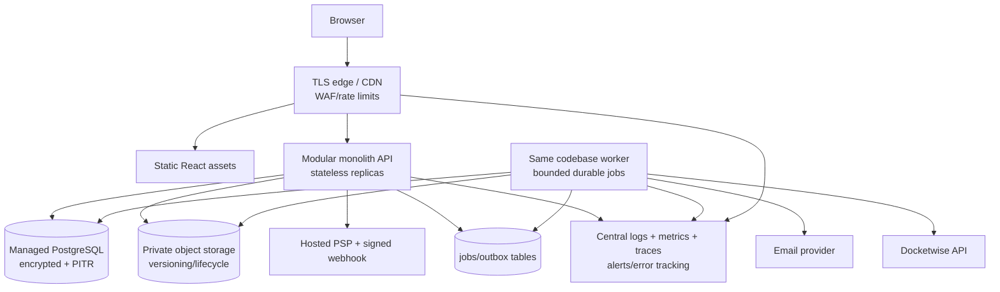
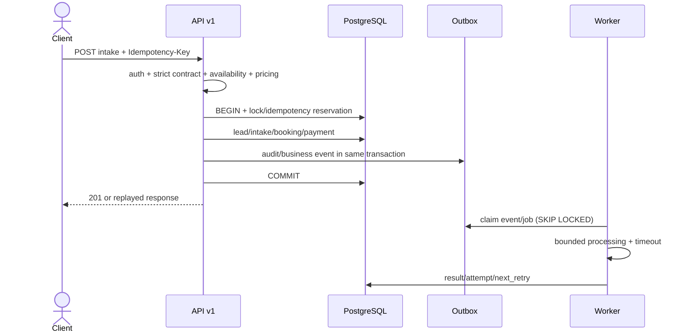
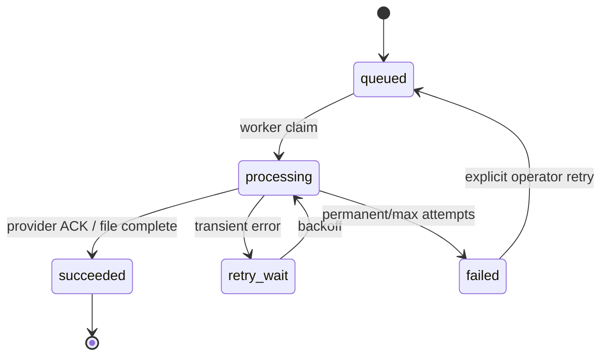

# Рекомендуемая целевая архитектура

## Принцип

Сохранить **modular monolith**: один backend codebase, один PostgreSQL schema и статический React frontend. Микросервисы сейчас не обоснованы ни нагрузкой, ни team topology. Усилить boundaries, транзакционность, durable jobs, security и operations.

## Что оставить

- React/Vite SPA и Nginx/static delivery.
- Express modular routes, Zod validation/response schemas.
- Domain policies для lead/packet/payment/privacy.
- Parameterized repositories и PostgreSQL migrations с advisory lock/checksum.
- Short-lived access token in memory + rotating HttpOnly refresh token.
- PostgreSQL как system of record.
- Pino/request ID, health/readiness, non-root backend.

## Что изменить

1. Безопасный staff bootstrap/invite; public registration всегда `user`; mandatory MFA/step-up.
2. Один versioned API contract/OpenAPI, из которого frontend получает types/client; pricing остаётся backend-authoritative.
3. Application use cases с явной transaction boundary. Audit/business events пишутся в той же транзакции через outbox; fail-open допускается только для диагностических logs.
4. Полный data inventory для DSAR/retention, атомарная DB anonymization и durable file deletion.
5. PostgreSQL-backed job/outbox worker как второй process того же приложения для email, CRM, retention и тяжёлого PDF. Redis не нужен до доказанной нагрузки.
6. Provider adapters: email и Docketwise имеют explicit `not_configured/queued/sent/failed/synced`, timeouts/retries/idempotency.
7. Managed encrypted PostgreSQL/backups и object storage с private objects/signed access/lifecycle; local driver остаётся development-only.
8. TLS edge, immutable images by digest, least privilege, resource limits, correct probes.
9. Metrics/error tracking/alerts и SLO до production traffic.

## Чего не усложнять

- Не делить auth/intake/DSAR/payments на network services.
- Не вводить Kafka/event sourcing/service mesh/Kubernetes без измеренной необходимости.
- Не дублировать PostgreSQL данными в отдельном search/cache, пока queries/indexes достаточны.
- Не делать live card processing внутри приложения: оставить hosted PSP checkout и verified webhooks.

## Target container diagram



`Outbox` здесь логически выделен, но физически остаётся таблицами того же PostgreSQL.

## Target intake request flow



## Target async flow



Каждая job хранит idempotency key, attempt count, timestamps, sanitized last error и correlation/request ID. `failed` заменяет отсутствующий DLQ на первом этапе; отдельный broker/DLQ можно добавить позднее.

## Модульные boundaries

```text
modules/
  identity/       auth, sessions, staff assurance
  intake/         case review, pricing, submission
  matters/        conflict, attorney review, lead state
  documents/      agreement/onboarding/PDF
  payments/       hosted link + webhook metadata
  privacy/        DSAR, retention, suppression
  integrations/   email, Docketwise, object storage adapters
platform/
  db, http, jobs, audit, observability, config
```

Каждый command handler получает `uow`, repositories/ports и actor context. Domain modules не импортируют Express/pg. Controllers не содержат business logic. Не требуется DI framework: достаточно composition root и explicit factories.

## Data/reliability rules

- Intake and idempotency record commit together.
- Audit event/outbox commit with protected mutation; failures не скрываются внутри active transaction.
- DSAR state transition — compare-and-set/version + row lock.
- DB anonymization is atomic; file deletion is resumable and `completed` follows verified completion/declared legal exception.
- Email/CRM provider ACK, а не локальный вызов, определяет sent/synced.
- Payment webhooks проверяют signature, event idempotency и permitted transition.
- Backups include DB/object versions/key metadata; restore test is a release/operations control.

## Безопасная последовательность миграции

1. Исправить SEC-001 без structural refactor; мигрировать/bootstrap existing admin.
2. Добавить реальные core integration tests и strict intake contract; сохранить потерянные fields новой additive migration.
3. Добавить idempotency table и atomic intake handler.
4. Исправить DSAR inventory/transaction/post-conditions; только затем включить scheduler.
5. Ввести generic jobs/outbox tables и worker сначала для email; потом Docketwise/PDF/file cleanup.
6. Подключить production providers в sandbox/staging; старые stub statuses мигрировать в `simulated/not_connected`, не считать synced.
7. Перенести files в private object storage с dual-read/dual-write и проверкой checksums; не удалять local copy до backup/restore proof.
8. Включить MFA, TLS, encrypted backups, observability и operational alerts.
9. Разделять API replicas/worker и managed services только после load/capacity test.

## Acceptance для staging/production

Staging: P0=0; dependency audits green; real DB + E2E core flow; email/CRM sandbox semantics honest; TLS; backup restore proof; metrics/alerts; no unresolved High without accepted owner/rationale.

Production: дополнительно MFA/step-up, encryption evidence, retention scheduler, DSAR deletion post-condition, PSP allowlist/webhook policy, incident contacts/on-call, legal/privacy/accessibility sign-off и tested rollback.
