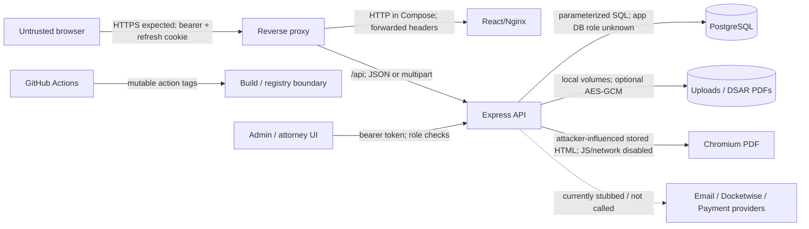
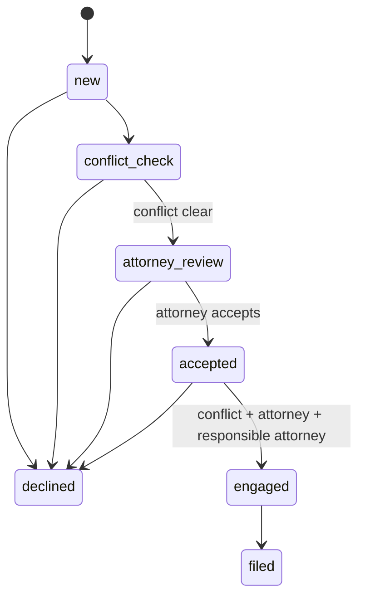
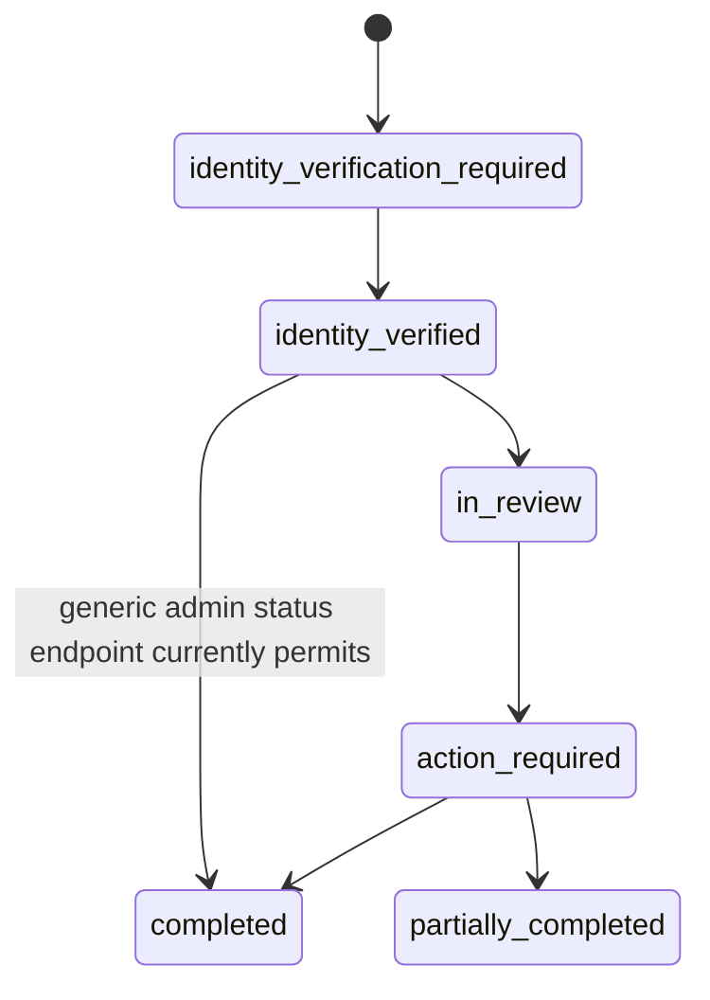

# Threat Model

## Архитектура и активы

Активы: user/admin/attorney accounts; access и refresh tokens; reset/verification/unsubscribe tokens; immigration/legal PII; intake, lead, booking и payment metadata; agreements/onboarding PDFs; DSAR records/exports; audit logs; PostgreSQL; Docker volumes; CI credentials и build artifacts.

Атакующие: anonymous internet user; обычный user; user, ищущий admin access; cross-user attacker; former/compromised staff; malicious uploader; supply-chain attacker; лицо с доступом к frontend bundle, browser profile или logs.

## Trust boundaries

| Граница | Данные | Identity / authorization | Encryption / integrity | Rate/resource control | При компрометации |
|---|---|---|---|---|---|
| Browser → proxy | credentials, PII, tokens | login + bearer/cookie | Production TLS NOT_VERIFIED | proxy 10 MiB | account/PII theft |
| Proxy → API | all API traffic | forwarded bearer; `trust proxy=1` | HTTP inside Compose | 100/15m/IP | spoofed headers if topology differs |
| API → DB | all records and tokens hashes | DB credential; DB role unknown | TLS default false in Compose | pool max 10; no statement timeout | total data compromise |
| API → files | public images, DSAR PDFs | app process | encryption optional | no quota | persistent PII exposure/disk exhaustion |
| API → Chromium | generated legal HTML | no separate identity | network blocked; JS off; sandbox off | concurrency 1, unbounded queue | backend availability / renderer escape risk |
| API → providers | email/Docketwise/payment | mostly absent/stub | not applicable | no provider timeout/retry because no calls | false business state |
| CI → dependencies/artifacts | source, tokens, artifacts | GitHub token | action SHA not pinned | timeouts exist | supply-chain compromise |

## Abuse cases

- Fresh deployment: anonymous attacker registers before operator and receives `admin`.
- Admin then reads all leads/DSARs, changes roles/payment state, uploads content, or invokes vulnerable Multer path.
- User submits urgent deadline/location; backend strips it while UI implies it will be reviewed.
- Admin marks Docketwise sync successful although nothing left the application.
- Admin completes deletion; PII remains in child rows, generated HTML, export JSON/PDF and DSAR request.
- Replayed intake/privacy submissions create duplicate state because no idempotency key exists.
- XSS/browser extension/shared workstation reads persistent intake PII from `localStorage`.
- Multipart nesting or aborted uploads consumes CPU/memory/disk in Multer 2.1.1.

## Critical state machines

Запрещены self-transition, backward transition, `new → accepted`, `accepted → filed`, `declined → *`. Эти ограничения присутствуют в `lead-state.policy.js`; конкурентные lost-update сценарии не защищены row lock/version column.

Для deletion переход в `completed` должен быть возможен только после transactionally verified post-condition по всем data stores; сейчас это не обеспечено.
